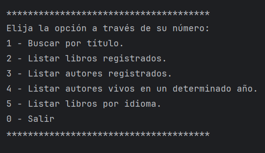

# Literatura

## Descripción

Esta es una aplicación de consola desarrollada en Java 17 que permite buscar libros utilizando la API de [Gutendex](https://gutendex.com/). 
La aplicación usa PostgreSQL 15.3 como base de datos y se puede ejecutar fácilmente usando Docker Compose.

## Requisitos

- Java 17
- Docker

## Instalación

Clone el repositorio en su máquina local:

```bash
[git clone https://github.com/luis13d/literatura-alura.git]
cd literatura
```

## Configuración de Docker

Asegúrate de tener Docker y Docker Compose instalados en tu máquina.

### Archivo `docker-compose.yml`

```bash
docker-compose up -d
```

## Detener los servicios

Para detener y eliminar los contenedores de Docker, usa el siguiente comando:

```bash
docker-compose down
```

## Ejemplo de Uso


